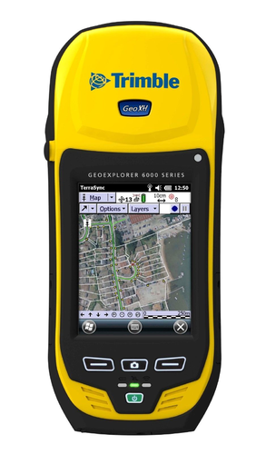
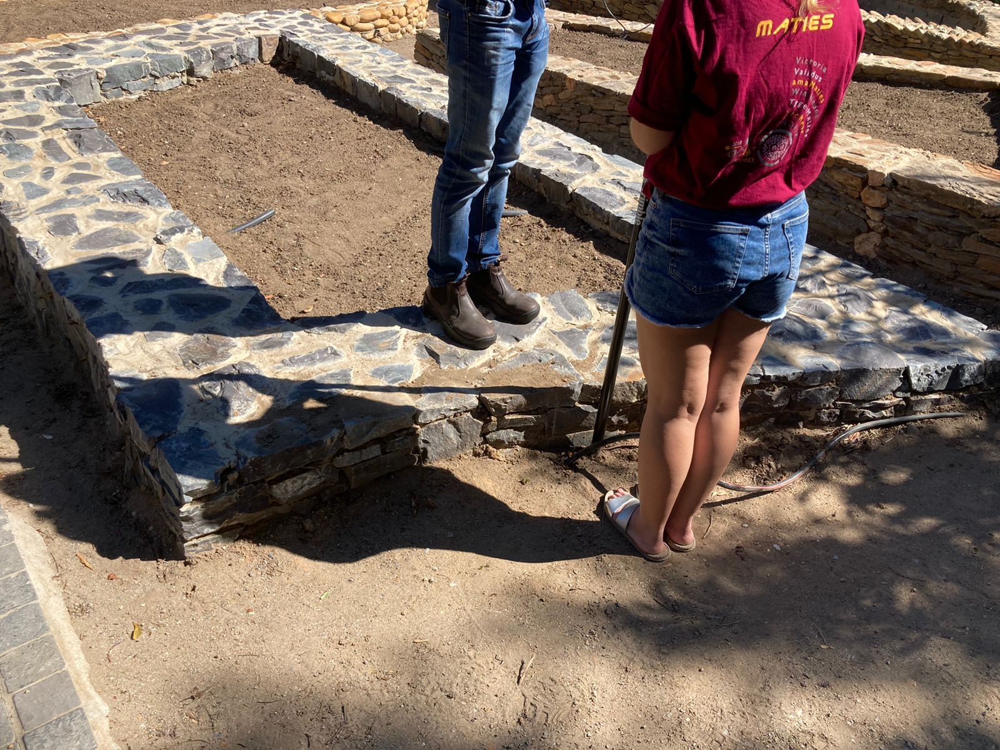
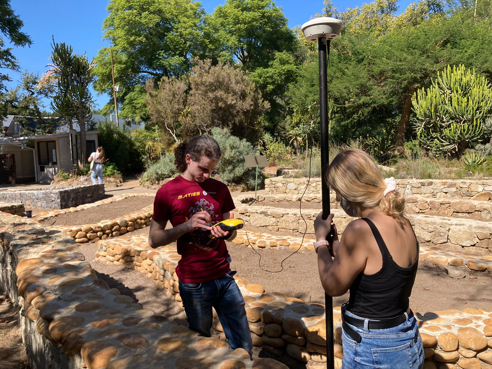
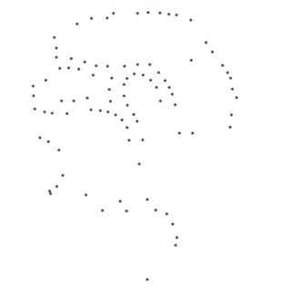
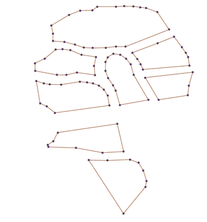
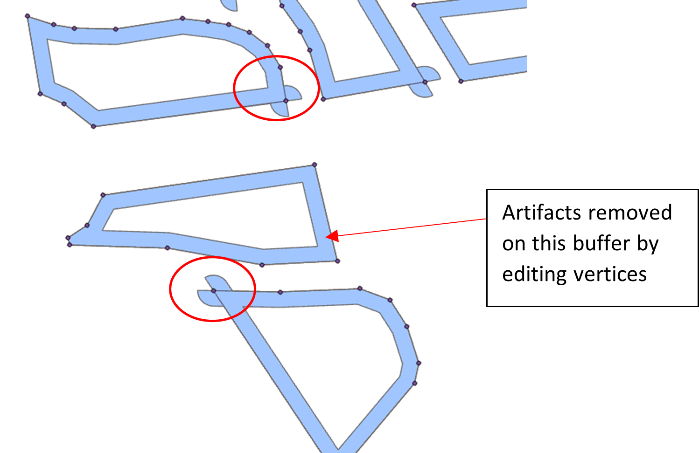
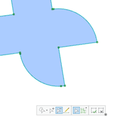
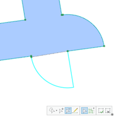
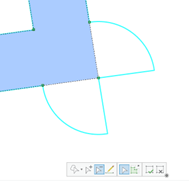
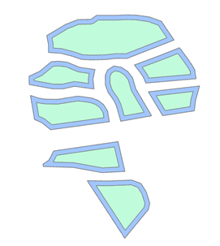

[Take me home](../../index.md#projects)

---

# Data Collection

During a project working with the Stellenbosch University Botanical Gardens (SUBG) myself and two others, [Zandre Nieuwoudt](https://github.com/ZJnieuwoudt) & [Mila Toth](https://github.com/milesTeller), collected DGPS readings to generate high precision vector files of some new beds that had been built in the gardens. This was done using a Trimble GeoXH 6000 Differential GPS which can be seen in Figure 1.

|  |
| <b>Figure 1: The DGPS unit used for our data collection</b> |
	

Performing practical field work was a great learning experience and I feel it is an amazing way to learn how to use new technology. It also allows one to experience first hand the issues that one can face and definitely improves your ability to think outside the box to solve these issues. Our team worked well together with everyone excelling at their respective roles, while clear and friendly communication made it a lot easier to work out in the sun for hours! 

## Post Processing of DGPS points 

The PathFinder software was used to perform differential correction on the points. This resulted in a shapefile of the point locations we captured being generated which was subsequently imported into ArcPro (Figure 2).

|  |
| <b>Figure 2:</b> |

 A polyline layer was then created from these points, Figure 3.

|  |
| <b>Figure 3: The polyline layer corresponding to the new beds</b> |

The polyline layer was then buffered on the left hand side (because they were all collected in the same direction around beds) to get the bed walls. These buffers contained some weird artifacts, Figure 4, so the buffer features were edited as shown in Figure 5.

|  |
| <b>Figure 4: The artifacts generated from running the buffer tool</b> |

|  | 
|  | |
| <b>Figure 5: Editing performed on the buffer features</b> | |

A polygon layer was then generated from the polylines in Figure 3, and this was merged with the buffer layer to create the final bed polygons with there bordering walls included, Figure 6. This was then integrated into our database.

|  |
| <b>Figure : The final polygon layer of the newly mapped beds</b> |