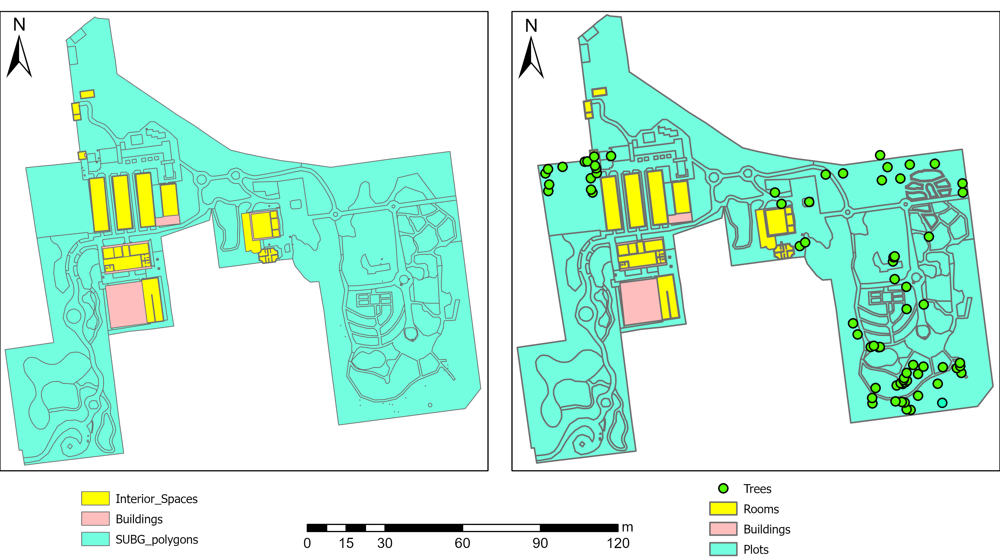

# Geodatabase Deliverable

During the same project as mentioned in [Data Collection](../pages/data_collect.md), our team made updates to the SUBG file geodatabase, as there were some issues with layers not overlaying correctly and the main reason being to integrate the new beds we had mapped with a DGPS.

A visual comparison of the feature classes in the database can be seen in Figure 1 with significant changes being the addition of the trees layer (previously captured by the 2021 Honours class and updated with more large trees by us), rubber sheeting of the Interior_spaces and Buildings layers to align correctly and the addition of the newly mapped beds in the north eastern corner of the gardens 
||
|:---:|
|Figure 1: Visual difference between original feature classes and the updated feature classes in the SUBG file geodatabase|

## Original Database

||
|:---:|
|Figure 2: caption|