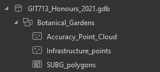
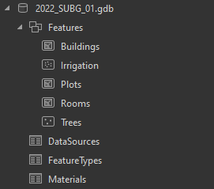

# Geodatabase Deliverable

During the same project as mentioned in [Data Collection](../pages/data_collect.md), our team made updates to the SUBG file geodatabase, as there were some issues with layers not overlaying correctly and the main reason being to integrate the new beds we had mapped with a DGPS.

A visual comparison of the feature classes in the database can be seen in Figure 1 with significant changes being the addition of the trees layer (previously captured by the 2021 Honours class and updated with more large trees by us), rubber sheeting of the Interior_spaces and Buildings layers to align correctly and the addition of the newly mapped beds in the north eastern corner of the gardens 

|  |
| <b>Figure 1: Visual difference between original feature classes and the updated feature classes in the SUBG file geodatabase</b>|

## Original Geodatabase

The origingal database that we were given consisted of a single polygon layer and a point layer, in addition there were two separate polygon files for the buildings. This can be seen in Figure 2 and Figure 3.
| |  |
| <b>Figure 2: The original geodatabase structure</b> | <b>Figure 3: Additional files |

## New Geodatabase

In our new geodatabase we had a few standalone tables that arose from the normalisation process and a feature dataset which ensured that all of our feature classes within comformed to the Transverse Mercator projection. The structure of the new geodatabase can be seen in Figure 4.

|  |
| <b>Figure 4: The new geodatabase structure</b> |