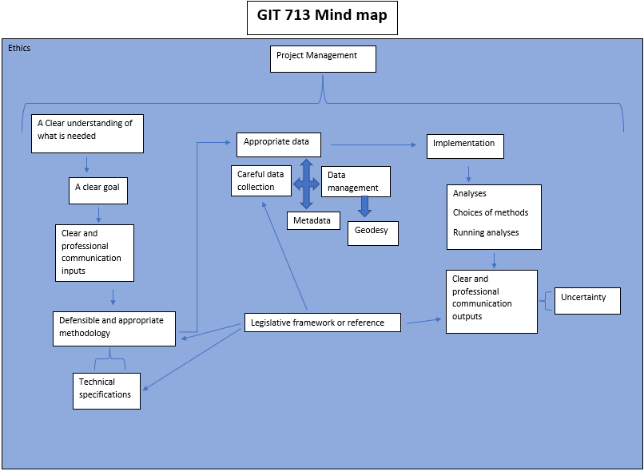

[Take me home](../../index.md#projects)

---

# GIT 713 Mind Map

|  |
| <b>Figure 1: GIT 713 Mind Map</b> |

Figure 1 shows my internal idea of what the GIT 713 module consists of and how everything links together. It has been a very insightful journey and has definitely brought together and solidified many of the concepts I have been attempting to internalise over the past 2 years of GIT modules.