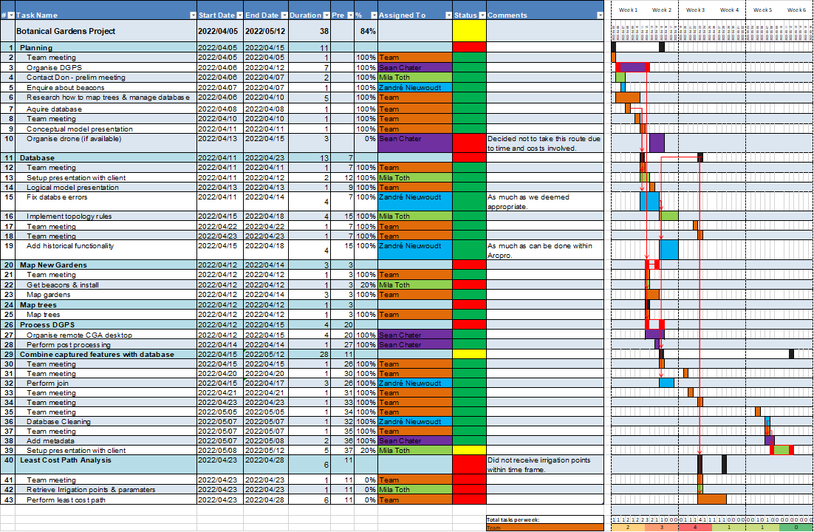

# Project management

Having been part of a team that worked with the Stellenbosch University Botanical
Gardens, I have improved my skills in managing a team as well as planning ahead
and overcoming unforseen obstacles. Two examples of this were getting access to the hardware and software, as the hardware needed to be borrowed and the software is proprietary.

To keep on track with this project our team proposed a Gantt chart at the beginning
of the project which outlined the flow of processes we were expecting to follow, who was responsible for
those processes and a rough timeline of when they were expected to be finished. The Gantt chart was based off a template that was developed in Microsoft Excel. This Gantt chart was
continuously updated throughout the project so we were sure to keep delivering on a consistent schedule, one of our iterations can be seen in Figure 1 to give an understanding of how it looks while a project is in progress.

|  |
| <b>Figure 1: An upated versino of our Gantt chart for the SUBG project</b>|

In hindsight, although it still served its purpose, a Gantt chart (in Excel format) may not have been the best option for our use case. Having the chart in Excel meant that the chart had to be maintained manually by someone every time a task was completed and there was no concurrent viewing of the chart unless a screenshot was shared on another platform or it was uploaded to a Onedrive account. There are many websites and applications nowadays that allow for easy and accessible projet management, such as ClickUp, Trello & Jira being a small group of these applications that I have personally used. I found that Trello had the simplest learning curve while still having enough functionality to be used for small to medium sized projects.

Seeing that our project was relatively small the Gantt chart remained simple enough to manually maintain, although one can see how complicated it could get with larger teams and projects extending over longer periods.