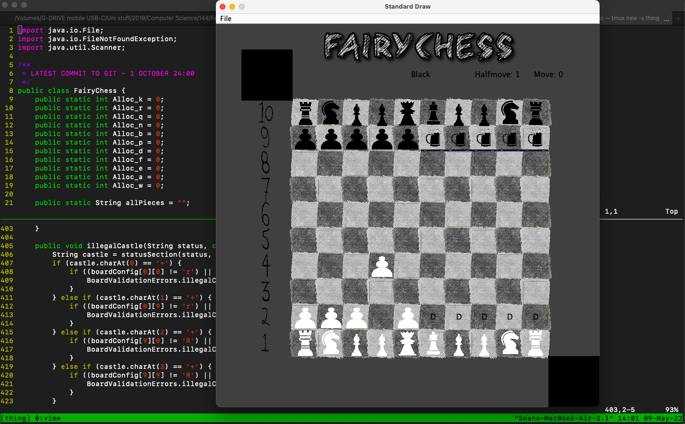

# Software Development Management

I have been exposed to version control systems (VCS) since 2019 and have been using them for university projects ranging from [small webscrapers](https://github.com/seanchater/webscraper) to games such as chess (Figure 1) and an othello bot, [client-server chat programs](https://github.com/seanchater/client-server_chat) and [VOIP applications](https://github.com/seanchater/voip_chat), [data cleaning](#data-cleaning-code-for-enron-dataset) and visualisation of the [Enron dataset](https://www.kaggle.com/datasets/wcukierski/enron-email-dataset) and a spatio-temporal social network website that allowed users to connect and find events close to them based on a map view (unfortunately this cannot be linked to as we removed it from the hosting service soon after the project ended due to hosting fees, but the video run through can be found on my [YouTube channel](https://www.youtube.com/channel/UCQouRawVAXWux-RRiOixJeA)).

|  |
| <b>Figure 1: Fairy Chess application, which is a modified version of normal chess</b> |

I used GitLab for the above mentioned projects, which means I also got a taste of CI/CD pipelines, as well as build automation tools such as Maven which was used on a small program for a honours topic assignment algorithm.

Once the learning curve has been dealt with, VCS's are actually quite intuitive to work with and definitely help with data management. Our team considered using a GitHub repo for our [Geodatabase project](../pages/geodb.md) but decided to back our database up to google drive for simplicity, and becuase we were using ArcPro to work with the database it was not possible to merge files if we had worked on the database concurrently, which means using Git would have just added extra steps to the process.

## Data cleaning code for Enron Dataset

I have included the python script I used to clean the Enron Dataset (which can be downloaded [here](https://www.kaggle.com/datasets/wcukierski/enron-email-dataset)) as I feel it is useful to have a practical example of what Pandas actually does to a dataset.

<details>
	<summary>
		```	
		import sys
		import pandas as pd
		import email
		import re
		import os
		from pprint import pprint
		#************ Input file ********************
		email_file = "emails.csv"
		#load file into a pandas object
		df = pd.read_csv(email_file)
		#******** Output files ************
		cleaned_file = "emails_cleaned.csv"
		employees_file = "employeeList.csv"
		message_file = "message.csv"
		recipientInfo_file = "recipientInfo.csv"
		```
	</summary>
	```
	#************* Dataframes ************
employee_list_cols = ["firstname", "lastname", "email_address"]
employee_df = pd.DataFrame(columns=employee_list_cols)
#employee_df = pd.read_csv(message_file)

message_cols = ["sender", "date", "message_id", "subject", "body", "folder"]
message_df = pd.DataFrame(columns=message_cols)
#message_df = pd.read_csv(message_file)

recipientinfo_df = pd.DataFrame()

# file, message <-- Fields (can ref in a dictionary manner)
# e.g row['file'] , row['message']

# _file is separated by '/'_

# name/mail_folder/email_num

# __Default content at the top of an email__

# Message-ID: 
# Date: 
# From:
# To:
# Subject:
# Mime-Version:
# Content-Type:
# Content-Transfer-Encoding:
# X-From:
# X-To:
# X-cc:
# X-bcc:
# X-Folder:
# X-Origin:
# X-FileName:

# __Followed by the actual email content__

'''
Iterates through main csv file
'''
def read_file():

	print("rows: {} \ncols: {}\n".format(df.shape[0], df.shape[1]))
	pd.set_option("display.max_colwidth", 20)

	print("adding sender col")
	df["sender"] = get_field("From", df["message"])
	print("adding date col")
	df["date"] = get_field("Date", df["message"])
	print("adding message_id col")
	df["message_id"] = get_field("Message-ID", df["message"])
	print("adding subject col")
	df["subject"] = get_field("Subject", df["message"])
	print("adding body col")
	df["body"] = get_body(df["message"])
	print("adding folder col")
	df["folder"] = get_folder(df["file"])
	print("adding To col")
	df["to"] = get_field("To", df["message"])
	df["to"] = df["to"].fillna(0)
	print("adding cc col")
	df["cc"] = get_field("CC", df["message"])
	df["cc"] = df["cc"].fillna(0)
	print("adding bcc col")
	df["bcc"] = get_field("BCC", df["message"])
	df["bcc"] = df["bcc"].fillna(0)
	print("Done extracting fields from message column\n")

	#remove rows that have files from discussion_threads, all_documents and sent_mail
	print("REMOVING: folders in which messages are present elsewhere")
	remove_dupe_folders()
	print("rows: {} \ncols: {}".format(df.shape[0], df.shape[1]))

	#remove rows with empty email bodys
	print("REMOVING: empty messages")
	remove_emptymessages()
	print("rows: {} \ncols: {}".format(df.shape[0], df.shape[1]))

	#remove emails that have the same date, subject, body and in the same folder
	print("REMOVING: duplicates")
	remove_duplicates()
	print("rows: {} \ncols: {}".format(df.shape[0], df.shape[1]))

	#convert undisclosed emails
	print("CONVERTING: undisclosed email")
	df["message"] = undisclosed(df["message"])

	#convert invalid emails
	print("CONVERTING: invalid emails")
	df["message"] = invalid(df["message"])

	print("\nFinal cleaned size:\nRows: {} \nCols: {}\n".format(df.shape[0], df.shape[1]))
	print("Exporting cleaned dataset to {}.csv".format(cleaned_file))
	#change index to true if you want each row to be numbered
	df.to_csv(cleaned_file, index=False)

	print("Main dataframe from input file: {}".format(email_file))
	print(df.head())
	print("Done")

	#creat employee list dataframe and export it to a csv file
	print("CREATING: employeeList dataframe")
	#change index to true if you want each row to be numbered
	populate_employee_list(df["message"])
	print(employee_df.head())
	employee_df.to_csv(employees_file, index=False)

	print("\nCREATING: message dataframe")
	#create message dataframe and export to csv file
	populate_message_df()
	print(message_df.head())
	message_df.to_csv(message_file, index=False)
	print("Done\n")
	
	print("CREATING: recipientInfo dataframe")
	populate_recipient_df()
	print(recipientinfo_df.head())
	print(recipientinfo_df.shape[0])
	recipientinfo_df.to_csv(recipientInfo_file, index=False)
	print("Done\n")

	print("Script Done")

def remove_dupe_folders():
	global df
	df.drop(df[df['folder'].str.contains("^discussion_threads$|^sent_mail$|^all_documents$", regex=True)].index , inplace=True)
	#need to reset indices of df because dropping a row leaves jumps in index numbers
	df = df.reset_index(drop=True)

def remove_emptymessages():
	global df
	df.drop(df[df['body'] == ''].index, inplace=True)
	df = df.reset_index(drop=True)

def remove_duplicates():
	global df
	df.drop_duplicates(subset=['date', 'subject', 'body', 'folder'], keep='first', inplace=True)
	df = df.reset_index(drop=True)

def undisclosed(messages):
	column = []
	for message in messages:
		e = email.message_from_string(message)
		try:
			if "undisclosed" in e.get("X-To"):
				e.add_header("To", "undisclosed-recipients@enron.com")
		except:
			e.add_header("To", "undisclosed-recipients@enron.com")
		message = e.as_string()
		column.append(message)

	return column

def invalid(messages):
	to_addresses = df["to"]
	#clean the recipients emails
	for i in range(len(to_addresses)):
		recip = to_addresses[i]
		recip_clean = "," 
		if (type(recip) != str):
			recip_clean += "no.address@enron.com"
			continue
		recip = recip.replace('\'', '')
		recip = recip.replace(' ', '')
		for address in recip.split(','):
			if re.search("^[a-z]+[.][a-z]+(@enron.com)$", address):
				recip_clean += address + ','
			else:
				recip_clean += "no.address@enron.com,"
		to_addresses[i] = recip_clean.strip(',')
	df["to"] = to_addresses
	'''
	column = []
	for message in messages:
		e = email.message_from_string(message)
		try:
			if e.get("To") == "undisclosed-recipients@enron.com":
				pass
			elif "enron" not in e.get("To"):
				e.replace_header("To", "no.address@enron.com")
		except:
			e.add_header("To", "no.address@enron.com")

		try:
			if e.get("From") == "undisclosed-recipients@enron.com":
				pass
			elif "enron" not in e.get("From"):
				e.replace_header("From", "no.address@enron.com")
		except:
			e.add_header("From", "no.address@enron.com")
		message = e.as_string()
		column.append(message)

	return column
	'''


'''
 Get employee names
'''
def get_employees(file):
	column = set()
	for string in file:
		column.add(string.split("/")[0])
	return list(column)

'''
	Gets a field from the MIME formatted email message and returns a column containing
	only those field values
	source: https://www.kaggle.com/ankur561999/data-cleaning-enron-email-dataset
'''
def get_field(field, messages):
	column = []
	for message in messages:
		e = email.message_from_string(message)
		column.append(e.get(field))
	return column

def get_folder(folders):
	column = []
	for folder in folders:
		column.append(folder.split('/')[1])
	return column

def convert_date(date):
	month_dict = {"Jan":'1', "Feb":'2', "Mar":'3', "Apr":'4', "May":'5', "Jun":'6', "Jul":'7', "Aug":'8', \
		"Sep":'9', "Oct":'10', "Nov":'11', "Dec":'12'}
	parts = date.split(' ')
	converted_date = []
	converted_date.append(parts[3])
	converted_date.append(month_dict[parts[2]])
	converted_date.append(parts[1])
	converted_date.append(parts[4])
	return '-'.join(converted_date)

'''
 Extracts the message body and returns a column containing only bodies
 source: https://www.kaggle.com/ankur561999/data-cleaning-enron-email-dataset
'''
def get_body(messages):
	column = []
	for message in messages:
		e = email.message_from_string(message)
		column.append(e.get_payload().strip())
	return column
	
'''
	Populates and cleans some cols of the messsage df
'''
def populate_message_df():
	message_df["sender"] = df["sender"] #get_field("From", df["message"])
	message_df["date"] = df["date"] #get_field("Date", df["message"])
	message_df["message_id"] = df["message_id"] #get_field("Message-ID", df["message"])
	message_df["subject"] = df["subject"] #get_field("Subject", df["message"])
	message_df["body"] = df["body"] #get_body(df["message"])
	message_df["folder"] = df["folder"] #get_folder(df["file"])

	dates = message_df["date"] 
	senders = message_df["sender"]
	for i in range(message_df.shape[0]):
		date = dates[i]
		date = convert_date(date)
		dates[i] = date
		sender = senders[i]
		i re.search("^[a-z]+[.][a-z]+(@enron.com)$", sender):
			pass
		else:
			sender = "no.address@enron.com"
		senders[i] = sender
		
	message_df["date"] = dates	
	message_df["sender"] = senders

	'''
	to_addresses = df["to"]
	for i in range(len(to_addresses)):
		recip = to_addresses[irecip = recip.replace('\'', '')
		recip = recip.replace(' ', '')
		recip_clean = "," 
		for address in recip.split(','):
			if re.search("^[a-z]+[.][a-z]+(@enron.com)$", address):
				recip_clean += address + ','
			else:
				recip_clean += "no.address@enron.com,"
		to_addresses[i] = recip_clean.strip(',')]
	'''


'''
	Populates the recipientInfo dataframe to be used for that table in the db
'''
def populate_recipient_df():
	global recipientinfo_df
	'''
		get indices of all df["to"]/df["cc"]/df["bcc"] cols where to is not 0
		and accompanying address of list of addresses
	'''
	cols = ["mid", "rtype", "rvalue"]
	to_indices = df.index[df["to"] != 0]
	to_addresses = df.iloc[to_indices.tolist(), 8].tolist()
	#clean the recipients emails
	for i in range(len(to_addresses)):
		recip = to_addresses[i]
		recip = recip.replace('\'', '')
		recip = recip.replace(' ', '')
		recip_clean = "," 
		for address in recip.split(','):
			if re.search("^[a-z]+[.][a-z]+(@enron.com)$", address):
				recip_clean += address + ','
			else:
				recip_clean += "no.address@enron.com,"
		to_addresses[i] = recip_clean.strip(',')
	to_df = pd.DataFrame(columns=cols)
	to_df["mid"] = to_indices
	to_df["rtype"] = 1
	to_df["rvalue"] = to_addresses

	cc_indices = df.index[df["cc"] != 0]
	cc_addresses = df.iloc[cc_indices.tolist(), 9].tolist()
	#clean the recipients emails
	for i in range(len(cc_addresses)):
		recip = cc_addresses[i]
		recip = recip.replace('\'', '')
		recip = recip.replace(' ', '')
		recip_clean = "," 
		for address in recip.split(','):
			if re.search("^[a-z]+[.][a-z]+(@enron.com)$", address):
				recip_clean += address + ','
			else:
				recip_clean += "no.address@enron.com,"
		cc_addresses[i] = recip_clean.strip(',')
	cc_df = pd.DataFrame(columns=cols)
	cc_df["mid"] = cc_indices
	cc_df["rtype"] = 2
	cc_df["rvalue"] = cc_addresses

	bcc_indices = df.index[df["bcc"] != 0]
	bcc_addresses = df.iloc[bcc_indices.tolist(), 10].tolist()
	#clean the recipients emails
	for i in range(len(bcc_addresses)):
		recip = bcc_addresses[i]
		recip = recip.replace('\'', '')
		recip = recip.replace(' ', '')
		recip_clean = "," 
		for address in recip.split(','):
			if re.search("^[a-z]+[.][a-z]+(@enron.com)$", address):
				recip_clean += address + ','
			else:
				recip_clean += "no.address@enron.com,"
		bcc_addresses[i] = recip_clean.strip(',')
	bcc_df = pd.DataFrame(columns=cols)
	bcc_df["mid"] = bcc_indices
	bcc_df["rtype"] = 3
	bcc_df["rvalue"] = bcc_addresses

	recip_frames = [to_df, cc_df, bcc_df]
	recipientinfo_df = pd.concat(recip_frames)

'''
 Populates the employee_list dataframe to be used for that table
 Go through all messages in inbox of each employee folder and get email and from
 that extract the name and surname
'''
def populate_employee_list(messages):

	#gets all the unique folders of all employees from the file field of csv
	employee_folders = df["file"].tolist()
	
	#populate dict with folders as keys, empty sets as values so no dupe emails in key-value pair
	employee_dict = {}
	for name in employee_folders:
		name = name.split('/')[0]
		employee_dict[name] = set()
	print(employee_dict)

	for i in range(df.shape[0]):
		folder = employee_folders[i]
		name = folder.split('/')[0]
		surname = name.split('-')[0]
		initial = name.split('-')[1]
		sender_addr = df["sender"].iloc[i]
		if (surname in sender_addr) and ("enron" in sender_addr):
			if re.search("^{}[a-z]+[.][a-z]+(@enron.com)$".format(initial), sender_addr):
				employee_dict[name].add(sender_addr.strip().replace('\'', ''))
		recip_list = df["to"].iloc[i]
		if recip_list == 0:
			continue
		else:
			recip_list = recip_list.split(',')
		for recip in recip_list:
			if (surname in recip) and ("enron" in recip):
				if re.search("^{}[a-z]+[.][a-z]+(@enron.com)$".format(initial), recip):
					employee_dict[name].add(recip.strip().replace('\'', ''))

	first = []
	last = []
	emails = []
	#extract names and surnames from emails
	for value in employee_dict.values():
		email_addr = list(value)
		if len(email_addr) > 0:
			for em in email_addr:
				first.append(em.split('.')[0])
				last.append(re.search("\.([a-z]*?)@", em).group(1))
				emails.append(em)

	#add all the coloumns to the employee dataframe for export
	employee_df["firstname"] = list(first)
	employee_df["lastname"] = list(last)
	employee_df["email_address"] = list(emails)


if __name__ == "__main__":
	print("************************Starting cleaning for input file: {}************************".format(email_file))
	read_file()
	```
</details>