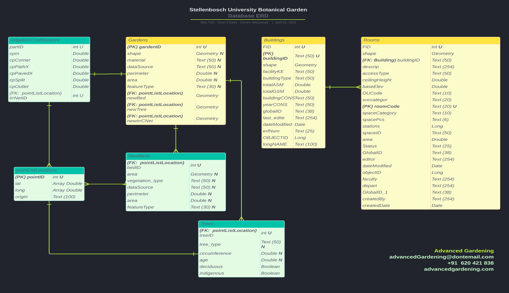
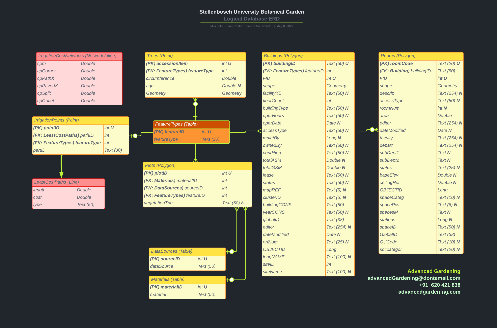

# GIS Strategy and Implementation (ERD)

For the project mentioned in [Data Collection](../pages/data_collect.md) we redesigned the file geodatabase of the SUBG. To begin with we started with a conceptual model of how we thought the geodatabase would best function, this is shown in Figure 1. We then met with the client to discuss if this updated model could work for them, what could be changed and what could be added or removed.

|  |
| <b>Figure 1: The initial conceptual model of the SUBG file geodatabase</b> |

After this meeting our team got back behind our laptop screens and began reworking the conceptual model into a logical schema, or an entity relationship diagram (ERD), by taking the clients suggestions into account and normalising all the tables. Figure 2 shows the ERD that was finalised with the client. As is evident it is quite different from the conceptual model but still contains all the relevant information. The only two tables that did not change much were the Buildings and rooms tables, as these contained specific fields that the client wanted to remain as is for him to sort through.

|  |
| <b>Figure 2: The final ERD for the SUBG file geodatabase</b> |

Designing this database as a team I found it difficult and encouraging. Difficult becuase there is no one way to go about the design process, as well as everyone having differnet mental paths they would like to follow to achieve a final product. With none of these paths being incorrect it is a difficult process to amalgamate all the ideas into one that works, nonetheless our team managed this in a professional manner and I think it shows in the products we delivered. I found it encouraging much in teh 