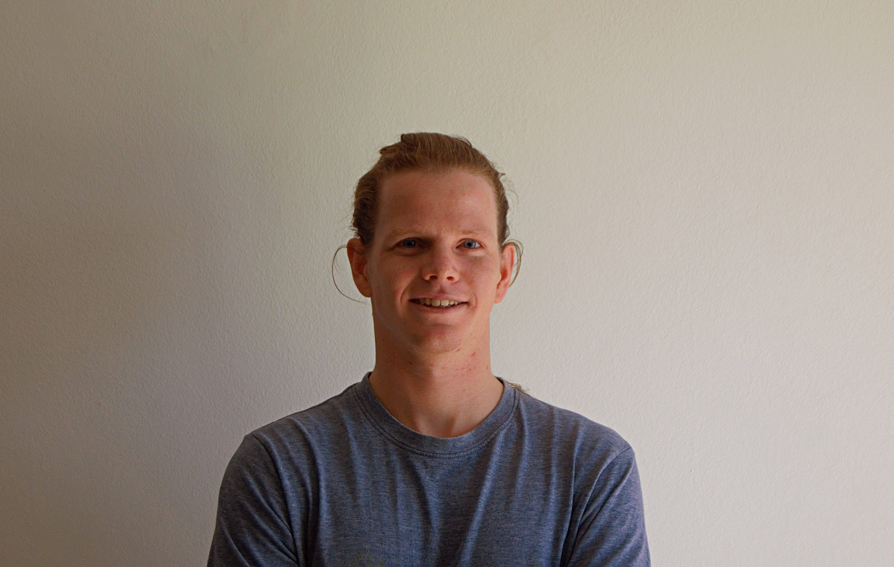

<!-- % -->

# Welcome to Sean Chater's portfolio

## About me
You can use the [editor on GitHub](https://github.com/seanchater/seanchater.github.io/edit/main/index.md) to maintain and preview the content for your website in Markdown files.

Some projects that have been completed in the past 7 weeks can be found by folling the links below.

- [Project management](assets/pages/project_man.md)
- [GIS Strategy and Implementation (ERD)](assets/pages/strat.md)
- [Data Collection](assets/pages/data_collect.md)
- [Geodatabase Deliverable](assets/pages/geodb.md)
- [Software Development Management](assets/pages/soft_dev.md)
- some other project
- maybe a cs project to show coding
- maybe some projects from 712 or other hons modules with easy to show deliverables
- miscellaneous (some cool adventures maybe)

## Reflection (on all pages maybe?)

For more details see [Basic writing and formatting syntax](https://docs.github.com/en/github/writing-on-github/getting-started-with-writing-and-formatting-on-github/basic-writing-and-formatting-syntax).