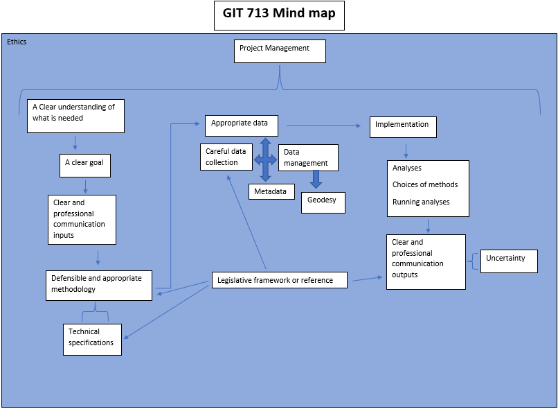

&nbsp;&nbsp;&nbsp;&nbsp;**Sean Chater**

&nbsp;&nbsp;&nbsp;&nbsp;**sean.chater@icloud.com**

&nbsp;&nbsp;&nbsp;&nbsp;[**LinkedIn**](https://www.linkedin.com/in/sean-chater-789380237/?original_referer=)

&nbsp;&nbsp;&nbsp;&nbsp;[**YouTube**](https://www.youtube.com/channel/UCQouRawVAXWux-RRiOixJeA)

 

---

# Welcome to Sean Chater's portfolio

## About me

I am a 4th year student at Stellenbosch University, currently doing my honours in Geoinformatics. I completed a Bachelors Degree in Geoinformatics in 2021 with my majors being computer science and geographical infomation technology.
I have a strong work ethic which was kindled while running a business in 2018 that ran for a year, selling organic seed slabs. I enjoy helping others, be it in academia, my professional or personal life and feel this enables me to work well in a collaborative environment by being a versatile member who is willing to take on any task, or take the lead if need be.

### Experience

- Stellenbosch University
  - Rock Climbing Club Executive Committee member: 2020 - present
  - Demonstrator for Earth Observation module in 2021 and 2022
- Pyranha Stunts: Stunt performer
- Marine Surf Lifesaving Club: Voluntary & Competitve Lifeguard for 5 years

### Education

- Stellenbosch University
  - BSc Geoinformatics (Computer science): 2019 - 2021
  - Honours Geoinformatics: 2022 - present
- Westville Boys' High School: 2014 - 2018

## Projects
Some projects that have been completed in the past 7 weeks can be found by folling the links below.

- [Project Management](assets/pages/project_man.md)
- [GIS Strategy and Implementation (ERD)](assets/pages/strat.md)
- [Data Collection](assets/pages/data_collect.md)
- [Geodatabase Deliverable](assets/pages/geodb.md)
- [Software Development Management](assets/pages/soft_dev.md)
- [Miscellaneous](assets/pages/misc.md)

## In Closing 

Figure 1 shows my internal idea of what the GIT 713 module consists of and how everything links together. Having implemented most of the steps in this mind map during the course of the module, I have a better idea of where the more 'conceptual' parts (in my mind) fit in, such as a legislative framework and how this can influence ethical decisions throughout a workflow. 

|  |
| <b>Figure 1: GIT 713 Mind Map</b> |

It has been a very insightful journey and has definitely brought together and solidified many of the concepts I have been attempting to internalise over the past 2 years of GIT modules.
