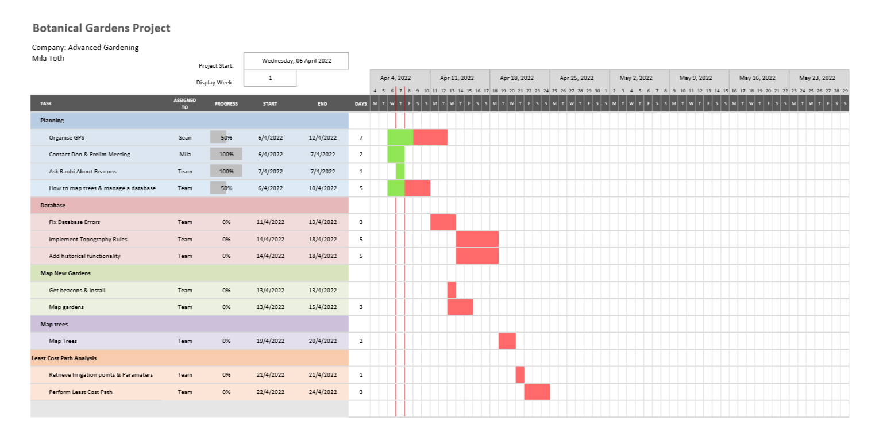

<!-- % -->

## Welcome to GitHub Pages

You can use the [editor on GitHub](https://github.com/seanchater/seanchater.github.io/edit/main/index.md) to maintain and preview the content for your website in Markdown files.

Whenever you commit to this repository, GitHub Pages will run [Jekyll](https://jekyllrb.com/) to rebuild the pages in your site, from the content in your Markdown files.

### Markdown

Markdown is a lightweight and easy-to-use syntax for styling your writing. It includes conventions for

```markdown
Syntax highlighted code block

# Header 1
## Header 2
### Header 3

- Bulleted
- List

1. Numbered
2. List

**Bold** and _Italic_ and `Code` text

[Link](url) and 
```
## Project management

Having been part of a team that worked with the Stellenbosch University Botanical
Gardens, I have improved my skills in managing a team as well as planning ahead
and overcoming unforseen obstacles. Some examples of this are ...

To keep on track with this project our team proposed a Gantt chart at the beginning
of the project which outlined the flow of processes we were expecting to follow, who was responsible for
those processes and a rough timeline of when they were expected to be finished. This Gantt chart was
continuously updated throughout the project so we were sure to keep delivering on a consistent schedule, one of our iterations can be seen below to give an understanding of how it looks while a project is in progress.


For more details see [Basic writing and formatting syntax](https://docs.github.com/en/github/writing-on-github/getting-started-with-writing-and-formatting-on-github/basic-writing-and-formatting-syntax).

### Jekyll Themes

Your Pages site will use the layout and styles from the Jekyll theme you have selected in your [repository settings](https://github.com/seanchater/seanchater.github.io/settings/pages). The name of this theme is saved in the Jekyll `_config.yml` configuration file.

### Support or Contact

Having trouble with Pages? Check out our [documentation](https://docs.github.com/categories/github-pages-basics/) or [contact support](https://support.github.com/contact) and we’ll help you sort it out.
